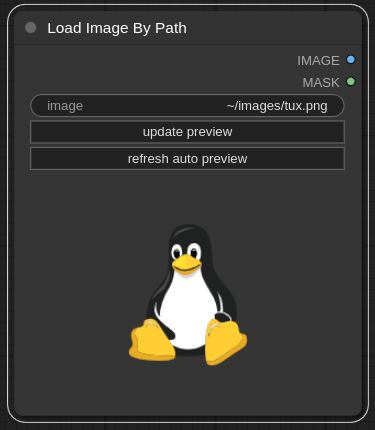

# ComfyUI Usability
A set of custom nodes for [ComfyUI](https://github.com/comfyanonymous/ComfyUI) developed with a goal of improving the convenience and usability.

# Nodes
## Load Image By Path: `KLoadImageByPath`
You can load image by absolute path using this node, and a preview will be generated, which can be updated automatically if the [watchdog](https://pypi.org/project/watchdog/) package is installed, which can be useful if you are constantly making edits to an image in an image manipulation program and exporting them with the same file name.

## Load Image By Path (Advanced): `KLoadImageByPathAdvanced`
Same as Load Image By Path but with some additional options.
By setting `enable_prefix_substitution` to true, if the input path starts with `prefix_to_substitute`, the prefix will be supplanted with `new_prefix` (e.g., if the file path is `/mnt/point/dir/my image.jpg`, `prefix to substitute` is `/mnt/point`, and `new_prefix` is `~/`, input path will be converted to `~/dir/my image.jpg`).
This can be useful if you are running ComfyUI on a remote server whose filesystem is mounted locally, because this eliminates the need to manually replace the mount point path of the file path.

## Load Image Dedup: `KLoadImageDedup`
(Note: it seems that a patch to the Load Image node achieving a similar functionality has been applied as of August 2024.)

Identical to the default Load Image (LoadImage) node, but if the opened image is already in the list of previously opened images (shared with that of Load Image node), it will not create another copy of that image (e.g., `my image (1).jpg`).
The equality of images is checked by first checking if images of the same name already exist in input images (this includes variations such as `my image (2).jpg`, `my image (5).jpg` etc. which are assumed to be file names generated automatically by ComfyUI when a
name conflict occurs), then comparing hashes of those images against the new input image.

The goal of this node is to reduce potential clutter in the input image list should one opens the same image over and over again by mistake.

If you leave the `overwrite_option` as `no_overwrite` (default), old input images will never be overwritten by the new input image.
If it is set to `input_filename`, the new image will overwrite the old image if they have the same filename.
If it is set to `last_rename`, and you have in input images: `my image.jpg`, `my image (1).jpg` and `my image (2).jpg`, and the new image is named `my image.jpg`, the new image will replace `my image (2).jpg`.

